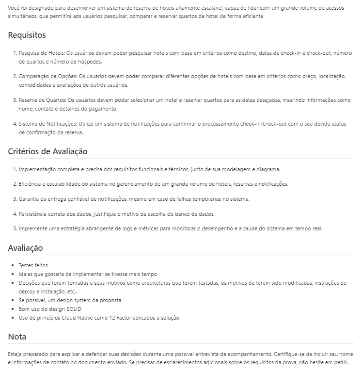

# Hotels

Este repositório é a resolução de um teste técnico. Todos os detalhes sobre o teste estão na imagem a seguir:



Nem todos os requisitos foram cumpridos ou implementados, sendo o principal motivo que eu usei o teste para reforçar habilidades que são meus pontos fracos, principalmente arquitetura de software, design patterns e DDD (Domain-Driven Design). Logo, todo o projeto foi pensado nisso, por isso o que mais você encontrará aqui serão padrões de projetos, entidades e interfaces.

Caso esteja estudando qualquer um desses assuntos, fique à vontade para explorar o código.

Atenciosamente,

## Índice

- [Tecnologias Utilizadas](#tecnologias-utilizadas)
- [Instalação](#instalação)
- [Uso](#uso)
- [Estrutura do Projeto](#estrutura-do-projeto)
- [Considerações Finais](#considerações-finais)

## Tecnologias Utilizadas

- **Prisma**: ORM para Node.js e TypeScript
- **PostgreSQL**: Banco de dados relacional
- **Node.js**: Ambiente de execução JavaScript no servidor
- **TypeScript**: Superset do JavaScript que adiciona tipagem estática
- **Express**: Framework para Node.js para construir APIs

## Instalação

1. Clone o repositório:

    ```sh
    git clone https://github.com/alissonFabricio04/hotels.git
    ```

2. Navegue até o diretório do projeto:

    ```sh
    cd hotels
    ```

3. Instale as dependências:

    ```sh
    npm ci --silent
    ```

4. Configure as variáveis de ambiente criando um arquivo `.env` baseado no `.env.example`:

    ```sh
    cp .env.example .env
    ```

5. Configure o banco de dados com Prisma:

    ```sh
    npx prisma migrate dev
    ```

## Uso

1. Inicie o servidor em modo de desenvolvimento:

    ```sh
    npm run dev
    ```

2. Acesse a aplicação em `http://localhost`

## Estrutura do Projeto

```plaintext
├── prisma
│   └── schema.prisma
├── src
│   ├── app
│   │   ├── queue
│   │   │   └── NotificationQueue.ts
│   │   ├── repositories
│   │   │   ├── HotelRepository.ts
│   │   │   ├── ReserveRepository.ts
│   │   │   └── RoomRepository.ts
│   │   └── use-casess
│   │   │   ├── CompareHotelsByLocation.ts
│   │   │   ├── CompareHotelsByPrice.ts
│   │   │   ├── CreateReserve.ts
│   │   │   ├── GetHotelsByCapacity.ts
│   │   │   ├── GetHotelsByDestination.ts
│   │   │   └── GetHotelsByPeriod.ts
│   ├── domain
│   │   ├── Double
│   │   │   └── index.ts
│   │   ├── Email
│   │   │   ├── Email.test.ts
│   │   │   └── index.ts
│   │   ├── Hotel
│   │   │   └── index.ts
│   │   ├── Id
│   │   │   └── index.ts
│   │   ├── Int
│   │   │   └── index.ts
│   │   ├── Location
│   │   │   └── index.ts
│   │   ├── PaymentMethod
│   │   │   └── index.ts
│   │   ├── Period
│   │   │   └── index.ts
│   │   ├── Reserve
│   │   │   └── index.ts
│   │   ├── Room
│   │   │   └── index.ts
│   │   └── RoomStatus
│   │       └── index.ts
│   ├── errors
│   │   ├── InternalServerError.ts
│   │   ├── NotFound.ts
│   │   ├── NotImplemented.ts
│   │   ├── StrategyErrors.ts
│   │   └── UnprocessableEntity.ts
│   ├── infra
│   │   ├── api
│   │   │   └── index.ts
│   │   ├── config
│   │   │   └── env.ts
│   │   ├── controllers
│   │   │   ├── CompareHotelsByLocationController.ts
│   │   │   ├── CompareHotelsByPriceController.ts
│   │   │   ├── CreateReserveController.ts
│   │   │   ├── GetHotelsByCapacityController.ts
│   │   │   ├── GetHotelsByDestinationController.ts
│   │   │   └── GetHotelsByPeriodController.ts
│   │   ├── database
│   │   │   └── DatabaseConnection.ts
│   │   ├── queue
│   │   │   └── NotificationQueueImpl.ts
│   │   ├── repositories
│   │   │   ├── HotelRepositoryImpl.ts
│   │   │   ├── ReserveRepositoryImpl.ts
│   │   │   └── RoomRepositoryImpl.ts
│   │   └── tests
│   │       ├── CreateReserveAPI.test.ts
│   │       └── GetHotelsAPI.test.ts
│   └── utils
│       ├── seedDatabase.ts
│       └── GenRandomCheckInAndOut.ts
├── .env.example
├── .gitignore
├── package-lock.json
├── package.json
├── README.md
├── requisitos.jpeg
└── tsconfig.json